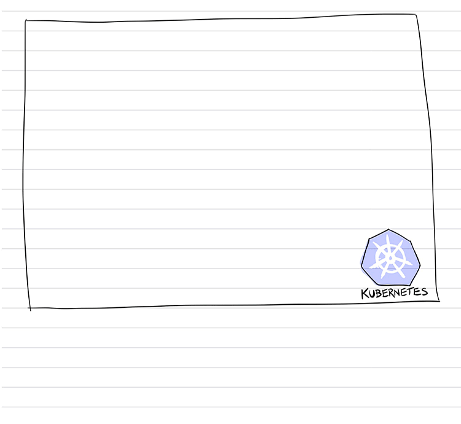
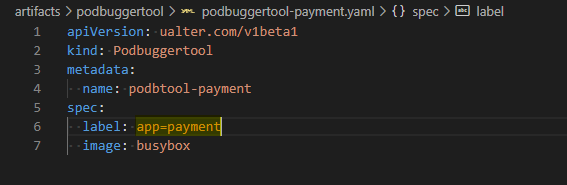

# PodBuggerTool

A Kubernetes Operator, with objective to help troubleshooting our application’s Pods, mainly in development environment when using distroless images.

---

### YAML to Install the Operator

---

### YAML to create a PodBuggerTool

---

Check:
https://ualterazambuja.com/2020/11/15/kubernetes-operators-in-go/